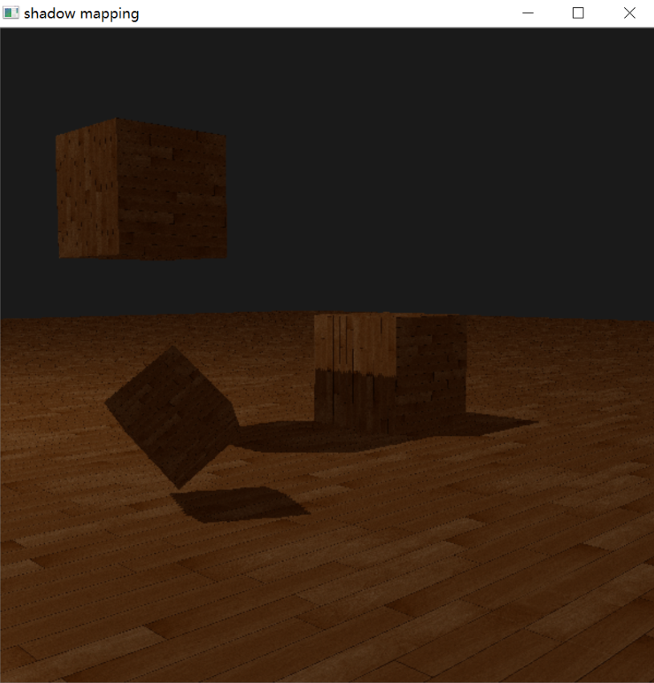

# Shadow Mapping Using glite

#### Intro

The glite library is an OpenGL realization running on CPU (soft rendering pipeline).
As you can see, the pipeline can accept GLSL shader code (runtime compilation).
The shadow mapping is supported, so it means that the off-screen rendering is also supported.
However, I currently don't allow rendering to color buffer because the lib is not fully tested.

#### Specs

Compiler: TDMGCC with gcc.exe (tdm64-1) 9.2.0

GUI dependency: OpenCV 

Mouse and Keyboard: supported by OpenCV

CPU limit: AVX should be supported

Multi-threading: forced open (takes huge amount of CPU resources)

#### Demo

